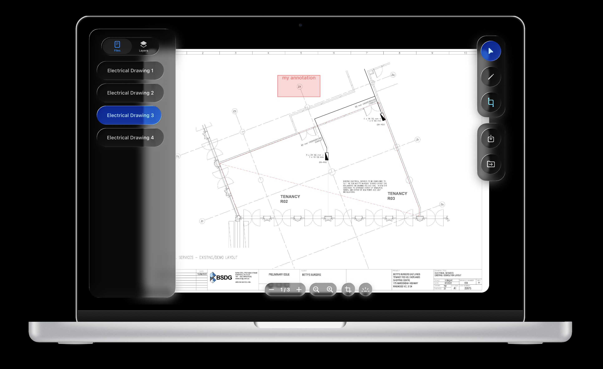

# Sonrai Annotator

Sonrai Annotator is a specialized, web-based tool designed for labeling and annotating electrical symbols on construction plan drawings (PDFs). Built with modern web technologies, it combines precise engineering tools with a high-fidelity, VisionOS-inspired user interface.

[Open Figma Prototype](https://www.figma.com/proto/WoiHwtWmBZsgkiONmttCid/Untitled?page-id=0%3A1&node-id=13-11&p=f&viewport=46%2C-710%2C0.58&t=sDe2N9LoMHw8CcUI-1&scaling=scale-down&content-scaling=fixed)

## Project Status & Scope Justification

This project was developed under a strict time constraint of 1.5 days, significantly compressing the originally proposed 4-week timeline. As a result, strategic decisions were made to prioritize Core UX/UI fidelity and Essential Annotation Workflows over peripheral features like export formats or custom label creation.

### Deviations from Original Requirements

| Feature | Status | Justification / Note |
| :--- | :--- | :--- |
| **Custom Labels** | Pending | The UI currently focuses on strict predefined categories to ensure data consistency. Custom text input is supported in the data model but not exposed in the UI yet. |
| **COCO/YOLO Export** | Pending | Priority was given to the proprietary JSON format to ensure full state restoration (UI fidelity) before implementing lossy ML exports. |
| **Keyboard Shortcuts** | Pending | Basic mouse interactions were prioritized for the MVP. |
| **Unit Tests** | Pending | Rapid prototyping phase focused on visual regression and interactive feel. |

*All pending features are slated for future development cycles.*

---

## Implemented Features

### PDF Visualization
*   **High-Performance Rendering:** Utilizes `react-pdf` for crisp rendering of architectural schematics.
*   **Navigation & Zoom:** Intuitive controls for page navigation, zooming, and panning.
*   **Auto-Fit Logic:** Automatically calculates the optimal scale to fit drawings within the viewport upon load.

### Smart Annotation System
*   **Constraint-Based Drawing:** Annotations are created by drawing a bounding box. The system automatically converts this into a standardized Group object (Rectangle + Text Label).
*   **Smart Resizing:**
    *   The annotation strictly adheres to the visual dimensions drawn by the user (accounting for stroke width).
    *   Text labels are automatically anchored to the top edge of the box and scale dynamically to ensure they always fit within the geometry, preventing overflow on small symbols.
*   **Categorized Toolset:** A comprehensive library of electrical labels (Lighting, Power, Data, Switches, etc.), each color-coded for instant visual recognition.

### VisionOS-Inspired UI
*   **Glassmorphism:** Floating toolbars and sidebars with background blur (`backdrop-blur-2xl`), frosted glass effects, and soft shadows.
*   **Adaptive Theming:** Full support for Light and Dark modes.
*   **Visual Identity:** A distinctive identity utilizing Coral (#FF6F61) accents against soft, gradient backgrounds.

### Data Persistence
*   **JSON Export/Import:** Full state serialization allows users to save their work to a local JSON file and restore it later with perfect fidelity.

---

## Overcoming Key Technical Challenges

The original specification identified three primary technical hurdles. Here is how our architecture addresses them:

### 1. Coordinate Transformation
**Challenge:** Mapping PDF coordinates (72 DPI points) to Screen coordinates (Pixels) across varying zoom levels.
**Solution:** We implemented a unified scaling pipeline in `AnnotationCanvas.tsx`. The application maintains a "Single Source of Truth" for coordinates in the raw PDF space. The rendering layer uses a dynamic multiplier (`scale`) to project these onto the canvas in real-time. This ensures that an annotation drawn at 100% zoom remains spatially accurate at 400% zoom without drifting.

### 2. Canvas Overlay Alignment
**Challenge:** Keeping the interactive annotation layer perfectly aligned with the underlying PDF during scrolling and resizing.
**Solution:** Instead of relying on manual DOM synchronization, we nested the `AnnotationCanvas` directly within the PDF page container. By using absolute positioning and shared dimensions derived from the PDF viewport, the canvas becomes structurally bound to the document. The "Infinite Canvas" padding strategy further reinforces this by ensuring both layers exist within the same scroll context, eliminating parallax errors.

### 3. Performance with Complex Drawings
**Challenge:** Handling heavy architectural PDFs without UI lag.
**Solution:** We leveraged `react-pdf`'s worker-based rendering to offload PDF processing from the main thread. Additionally, Fabric.js handles the vector layer (annotations) independently. By using `Zustand` for state management, we bypass unnecessary React re-renders, allowing the UI to remain responsive (60fps) even when manipulating annotations over high-resolution floor plans.

---

## Strategic Tool Selection for Efficient Data Annotation

To ensure high-quality data for machine learning model training, the following technical choices were made:

### Strict Schema Enforcement for Clean Data
**Technique:** Predefined Label Categories.
**Benefit:** By restricting input to a strict set of electrical classes (e.g., `downlight`, `gpo`), we eliminate "label noise" (typos, synonyms). This directly results in cleaner datasets, which is the single most important factor for training accurate Object Detection models.

### Fabric.js for Semantic Grouping
**Technique:** Using Fabric.js "Groups" to bind Text Labels to Bounding Boxes.
**Benefit:** In raw canvas implementations, labels and boxes are often separate entities that can become misaligned. By treating them as a single semantic object, we ensure that the label always travels with the annotation. This prevents data corruption where a label might visually drift to a neighboring object.

### Visual Validation via Color Coding
**Technique:** Category-specific colors (e.g., Amber for Lighting, Red for Power).
**Benefit:** This provides immediate visual feedback to the annotator. If a user accidentally labels a switch as a power outlet, the color mismatch makes the error obvious. This mechanism significantly reduces the False Positive rate in the training data.

---

## UX Improvisations & Design Notes

We implemented several specific design solutions to enhance usability within the unique "Floating UI" constraint:

### 1. The "Infinite Canvas" Overscroll
**Problem:** The floating, glass-like sidebar and toolbar are aesthetically pleasing but permanently occupy screen real estate. This posed a risk of obscuring PDF content located at the extreme edges of the document.
**Solution:**
*   **Massive Padding:** We implemented a padding strategy (`px-[35vw]`, `py-32`) around the PDF container.
*   **Overscroll Capability:** This creates an "Infinite Canvas" feel, allowing the user to overscroll the document far beyond the viewport boundaries.
*   **Result:** Users can pan the document edges into the clear center view, ensuring no content is ever permanently hidden behind the UI, while maintaining the immersive "floating" look.
*   **Auto-Centering:** Despite the massive scroll area, the view automatically centers itself on the document whenever a file is loaded or zoomed.

### 2. High-Contrast Layering
**Problem:** Rendering UI elements over complex, high-contrast PDF engineering drawings can lead to readability issues.
**Solution:**
*   **Visibility Check:** We ensured that the icon set (`lucide-react`) and project fonts utilize sufficient contrast and z-indexing.
*   **Result:** UI elements remain clearly legible above the PDF surface in all modes (Light/Dark), ensuring the "Glass" effect never hinders functional utility.

---

## Project Structure & Tech Stack

The project structure was adapted to better suit the `Vite` + `Fabric.js` ecosystem.

### Tech Stack
*   **Framework:** React 19 + TypeScript
*   **Build Tool:** Vite
*   **Styling:** Tailwind CSS v4
*   **Canvas Engine:** Fabric.js v6 (Chosen over HTML5 Canvas for robust object handling)
*   **PDF Engine:** React-PDF
*   **State Management:** Zustand

### Directory Structure
```
src/
├── components/
│   ├── AnnotationCanvas.tsx  # Core interaction layer (Fabric.js integration)
│   ├── PdfViewer.tsx         # PDF rendering & Infinite Canvas logic
│   ├── Sidebar.tsx           # File navigation & Layer management
│   └── Toolbar.tsx           # Tool selection & Actions
├── store/
│   └── useAnnotationStore.ts # Global state (Zustand)
├── types/
│   ├── annotation.ts         # Data models
│   └── annotation-state.ts   # State interfaces
├── utils/
│   └── fabric-utils.ts       # Smart Shape Generation (Factory Pattern)
├── App.tsx                   # Layout & Floating UI Composition
└── main.tsx                  # Entry point
```

---

## Getting Started

### Prerequisites
*   Node.js (v18 or higher recommended)
*   npm

### Installation

1.  **Clone the repository**:
    ```bash
    git clone <repository-url>
    cd electrical-annotation-tool
    ```
2.  **Install dependencies**:
    ```bash
    npm install
    ```

### Running Development Server
Start the local development environment with hot-reloading:
```bash
npm run dev
```
Open your browser to `http://localhost:5173`.

### Building for Production
Create a production-ready build:
```bash
npm run build
```
The output will be generated in the `dist/` directory.

---

## Future Roadmap

To align fully with the original specification, the following updates are planned:

1.  **Export Utilities:** Implement `utils/export.ts` to convert the internal JSON format to standard COCO/YOLO datasets for ML training.
2.  **Advanced Interactions:** Add keyboard shortcuts (Delete, Ctrl+Z for Undo).
3.  **Custom Labels:** Add a UI component to allow users to define new label types on the fly.
4.  **Testing:** Implement `vitest` unit tests for the `useAnnotationStore` and `fabric-utils`.

---

Made with by - Ashwin Sharma

## License

© 2024 Ashwin. All Rights Reserved.

This software is proprietary and confidential. Unauthorized copying, distribution, modification, or use of this
software, via any medium, is strictly prohibited without express written permission from the copyright holder.
